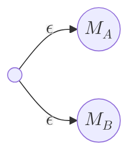

Machines are equivalent if and only if they recognise the same language.

>[!Info] Theorem
>Every NFA has an equivalent DFA
>
>How? *Simulate* an NFA using a DFA

## Subset Construction

Remember $\epsilon$ transitions are immediately taken (i.e. both states happen at the same time)
![[nfa-to-dfa.png]]

(Typically the table method is cleaner than the graph)

### Formal Definition
Let $N = (Q, \Sigma, \delta, q_0, F)$ be  an NFA
For all $R \subseteq Q$, let $E(R)$ be the $\epsilon$ closure of $R$. That is,
$$E(R) = \{q \in Q \ | \ \text{q is reachable from some } r \in R \text{ by following 0 or more $\epsilon$ transitions} \}$$

Let $M = (Q', \Sigma, \delta', q_0', F')$ be a DFA such that
- $Q' = \mathscr{P}(Q)$
	- Set of states is transformed
- $q_0' = E(\{q_0\})$
	- Starting state is ...
- $F' = \{R \in Q' \ | \ \text{R contains an accept state of N} \}$
	- New accept states are a subset of original accept states
- $\delta'(R,a) = \bigcup_{r \in R}E(\delta(r,a))$
	- New transition function

>[!Info] Theorem
>The NFA $N$ is *equivalent* to the DFA $M$

## Operations on Regular Languages

### Closure Under Union

If $A$ and $B$ are recognised by some DFAs $M_A$ and $M_B$, respectively. Then this NFA recognises $A \cup B$

And because we've established NFAs can be represented as equivalent DFAs, and any regular language is representable as a DFA - then $A \cup B$ must be regular.

### Closure Under Concatenation

If $A$ and $B$ are regular, then we can establish $A \circ B$ is regular by connecting the DFAs using epsilon transitions.

So, the accept states for the DFA of $A$ are connected via epsilon transitions to the starting state of the DFA for $M_B$

![[closure-transition-rules.png]]

### Closure Under Kleene Star

If a DFA ($M_A$) recognises $A$, we can consider an NFA where all *accept* states of $M_A$ have an epsilon transition back to the starting state.

## Equivalence of DFAs

We can always find a minimal DFA for a given regular language (having the smallest possible number of states)
- Since a DFA has a unique start state and the transition function is total and deterministic, we can test two DFAs for equivalence by minimising them

### Generating a Minimal DFA

1. Reverse the NFA
2. Determinise the result
3. Reverse again
4. Determinise

To reverse NFA $A$ with initial state $q_0$ and accept states $F \neq \emptyset$:
1. If $F = \{q\}$, let q be the accept state
2. Otherwise add a new state $q$ which becomes the only accept state; then, for each state in $F$, add an $\epsilon$ transition to $q$
3. Reverse every transition in the resulting NFA, making $q$ the initial state and $q_0$ the (only) accept state

